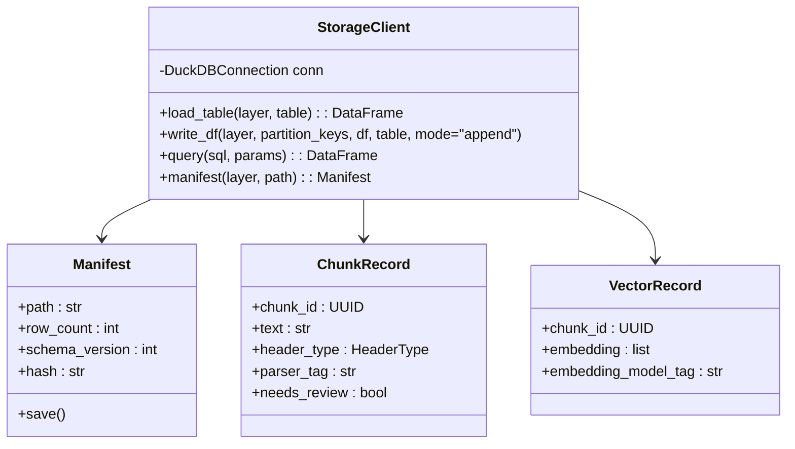
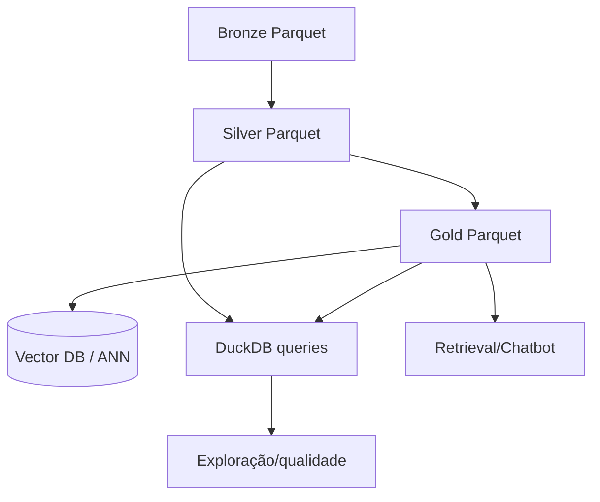
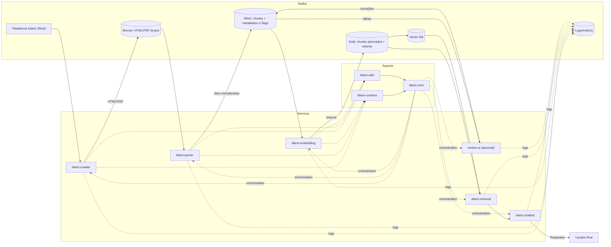

# Persistência local para `diario-utils`

Projeto de módulo de persistência local, pronto para evolução à nuvem, alinhado à arquitetura medallion (Bronze/Silver/Gold) e às definições de contratos e repositórios do projeto.

## Objetivos e princípios
- Minimizar uso de disco com formatos colunares comprimidos e deduplicação.
- Garantir reprodutibilidade e trilha de auditoria (tags de versão de crawler/parser/embedding).
- Suportar consultas leves (amostras, contagens) e intensas (scans para embedding/retrieval offline).
- Manter API única, isolando detalhes de storage para futura migração cloud (S3/GCS + catalog/iceberg/delta).

## Stack sugerida
- **Formato**: Parquet com compressão ZSTD (nível 3–6) e statistics para predicate pushdown.
- **Catálogo/engine local**: DuckDB 0.9+ para queries SQL e integração com Parquet; exposto via `duckdb` Python.
- **Esquemas/contratos**: Pydantic (já usado) para validação e mapeamento para tabelas.
- **Particionamento**: por `layer` (bronze|silver|gold), `city_id`, `publication_date` (YYYY=MM), e opcional `parser_tag` / `embedding_model_tag` para comparações.
- **Manifests**: metadados adicionais em `*_manifest.json` com hashes, row counts, schema version.

## Layout de diretórios (local)
```
data/
  bronze/
    city_id=123/yyyymm=202603/
      gazette.parquet
      manifest.json
  silver/
    city_id=123/yyyymm=202603/parser_tag=v1/
      chunks.parquet
      manifest.json
  gold/
    city_id=123/yyyymm=202603/embedding_model_tag=e5-base/
      chunks.parquet      # curados
      vectors.parquet     # embeddings densos (opcional)
      manifest.json
  logs/
    ingestion.log         # structlog; também enviado ao LOGS sink do core
```

## Esquemas principais (Parquet)
- **gazette.parquet (Bronze)**  
  - `ingestion_run_id` (string), `crawler_tag` (string), `city_id` (string), `publication_date` (date), `edition_id` (string)  
  - `edition_number` (int), `supplement` (bool), `edition_type_id` (int), `edition_type_name` (string)  
  - `pdf_url` (string), `content_type` (enum: html/pdf/text), `raw_content` (binary or string)

- **chunks.parquet (Silver/Gold)**  
  - Identidade: `chunk_id` (uuid), `article_id` (string), `edition_id` (string), `city_id` (string)  
  - Conteúdo: `text` (string), `raw_html` (optional string), `table_json` (optional json)  
  - Metadados: `header_type` (enum), `hierarchy_path` (array \< string \>), `quality_score` (float), `needs_review` (bool), `parse_status` (enum: ok/warn/fail), `regex_profile_version` (string), `entities` (array\< dict \>)
  - Versões: `parser_tag` (string), `chunk_schema_version` (int)  
  - Revisão: `review_status` (enum: pending/approved/rejected), `reviewer_id` (string), `reviewed_at` (timestamp), `change_log` (string)

- **vectors.parquet (Gold opcional)**  
  - `chunk_id` (uuid, fk chunks), `embedding` (array<float>), `embedding_model_tag` (string), `dim` (int), `norm` (float), `retrieval_profile` (string)

## Diagrama de classes (mermaid)


## Diagrama de dados (camadas e consumo)


## API proposta (`diario_utils.storage`)
- **Configuração**  
  - `StorageConfig(base_path, duckdb_path=":memory:", compression="ZSTD", threads=4)`

- **Leitura/consulta**  
  - `load_chunks(layer="silver", city_id=None, month=None, parser_tag=None, columns=None) -> pl.DataFrame`  
  - `load_vectors(embedding_model_tag=None, retrieval_profile=None, columns=None) -> pl.DataFrame`  
  - `query(sql: str, params: dict=None) -> pl.DataFrame` (pass-through para DuckDB; suporta joins leves/intensos)

- **Escrita**  
  - `append_gazettes(df, partition_keys: dict)`  
  - `append_chunks(df, partition_keys: dict)`  
  - `append_vectors(df, partition_keys: dict)`  
  - Todas calculam hash, atualizam `manifest.json` e validam schema via Pydantic.

- **Manifests e auditoria**  
  - `get_manifest(layer, partition_path) -> Manifest`  
  - `validate_schema(df, schema_version) -> None`  
  - `register_run(run_id, layer, tag, row_count, status)` para logs estruturados.

- **Facilidades de revisão**  
  - `list_needing_review(limit=100, city_id=None) -> pl.DataFrame`  
  - `apply_review(chunk_id, reviewer_id, new_text=None, status="approved", change_log=None)`  
  - `promote_to_gold(chunk_ids, embedding_model_tag, retrieval_profile)` escreve em `gold/`.

### Características de performance
- Parquet + ZSTD + predicate pushdown via DuckDB para minimizar I/O em consultas seletivas.
- Particionamento por cidade/mês reduz scans; `sampling` via `TABLESAMPLE` DuckDB para inspeção rápida.
- `append` idempotente com dedup por `chunk_id` (DuckDB `INSERT OR REPLACE` sobre staging antes do write final).

### Preparação para nuvem
- Base path abstrato: aceita `file://`, `s3://`, `gs://` (via DuckDB + s3 extension) sem mudar API pública.
- Manifests já compatíveis com catálogos externos (Glue/Iceberg/Delta) se adotados no futuro.
- Separação clara de schema/contratos em `diario-contract` para reutilizar em jobs cloud.

## Interação com a cadeia RAG
- `diario-crawler` usa `append_gazettes` (layer bronze).
- `diario-parser` lê bronze, escreve silver com flags de qualidade e tags de regex/parser.
- `diario-review` consome silver com `needs_review=true`, aplica `apply_review`, promove quando aprovado.
- `diario-embedding` lê silver/gold conforme modo, escreve vectors com `embedding_model_tag`.
- `diario-retrieval` consulta gold/vectors via DuckDB ou direto no VDB, mantendo versão nos metadados das respostas.

## Testes mínimos recomendados
- Round-trip Parquet: escrever/ler e validar schema + manifest.
- Predicate pushdown: filtros por city_id/month retornam menos linhas que full scan.
- Dedup: inserir chunk duplicado mantém apenas uma versão.
- Review flow: marcar `needs_review`, aprovar e verificar promoção para gold.
- Compatibilidade de tags: erro controlado se `embedding_model_tag` ausente ou divergente do esperado.


# Reflexões sobre organização dos repositórios

Este documento aprofunda a estratégia de separar a solução RAG para diários oficiais em múltiplos repositórios especializados. Avaliamos ganhos, perdas e mitigadores e trazemos um diagrama de fluxo que evidencia o relacionamento entre serviços e artefatos de dados.

## Ganhos do desenho proposto (multi-repo orientado a domínio)
- **Isolamento de responsabilidade**: cada serviço tem ciclo próprio de release e dependências controladas (crawler não precisa das libs de chatbot).
- **Escalabilidade técnica**: permite variações tecnológicas por estágio (ex.: drivers de scraping vs. bibliotecas de ML) sem arrastar o stack inteiro.
- **Segurança e compliance**: credenciais e escopos podem ser segregados por repositório (ex.: crawler acessa origens públicas; retrieval/vector DB fica em rede interna).
- **Ciclos de CI/CD mais rápidos**: pipelines menores, testes focados, e cache específico por domínio reduzindo tempo de feedback.
- **Manutenção de contratos explícitos**: `diario-contract` força versionamento de modelos Pydantic, diminuindo breaking changes silenciosos.
- **Experimentação paralela**: times podem testar novos chunkers ou modelos de embeddings sem bloquear ingestão ou chatbot.

## Perdas, riscos e mitigadores
- **Sobrecarga de coordenação**: PRs multiplos para uma mudança transversal. *Mitigação*: releases coreografiadas via `diario-core` com versão travada de cada serviço (docker-compose com tags imutáveis) e ADRs curtas para alterações de contrato.
- **Version skew**: divergência entre produtores/consumidores de dados. *Mitigação*: versionar `diario-contract` (ex.: SemVer) e publicar pacote; testes de contrato no CI de todos os repositórios.
- **Duplicação de utilitários**: tendência a reimplementar helpers. *Mitigação*: `diario-utils` distribuído como wheel/zipapp; lint que bloqueia cópias locais.
- **Visibilidade fragmentada**: difícil rastrear ponta-a-ponta. *Mitigação*: dashboards de orquestração no `diario-core`, logs estruturados (structlog) com trace-id compartilhado.
- **Onboarding mais complexo**: novos contribuidores precisam clonar vários repos. *Mitigação*: script de bootstrap no `diario-core` que clona tudo e configura envs.
- **Gestão de dependências duplicada**: versões distintas de libs. *Mitigação*: arquivo de referências (constraints.txt) compartilhado e check automático de drift.

## Recomendações práticas
- Publicar `diario-contract` e `diario-utils` em registry privado; usar pins exatos em requirements.
- Manter modelos de dados e schemas como fonte única no contrato; gerar clientes/stubs a partir dele.
- Centralizar configuração de observabilidade (logging/metrics/tracing) em `diario-utils` para uniformidade.
- No `diario-core`, definir dois perfis de `docker-compose`: `pipeline` (crawler→parser→embedding) e `chatbot` (retrieval→chatbot com DB pré-populado).
- Adotar matriz de compatibilidade (serviço x versão do contrato) e testes de fumaça ponta-a-ponta em cada release.

## Arquitetura medallion aplicada ao RAG
- **Por que usar**: adiciona checkpoints de qualidade e linage clara; facilita rollback e reprocessamento quando regex ou modelos mudam; prepara terreno para revisão humana.
- **Bronze (bruto)**: HTML/PDF + `ingestion_run_id` + `crawler_tag` (git tag/commit). Nada é descartado; serve de prova e reprocessamento.
- **Silver (normalizado)**: chunks extraídos com metadados enriquecidos e flags de qualidade. Campos sugeridos em `diario-contract`: `parser_tag`, `regex_profile_version`, `parse_status` (ok/warn/fail), `quality_score`, `needs_review` (bool) e amostra de erro. Regex que falha marca `needs_review=true` e conserva o trecho original.
- **Gold (curado)**: apenas registros aprovados (automático ou humano). Inclui `embedding_model_tag`, `retrieval_profile`, `chunk_schema_version`, `review_status` (pending/approved/rejected) e histórico de correções. Gold é fonte para VDB e para o chatbot.
- **Versionamento via tags**: cada serviço injeta sua versão (git tag ou `git describe --tags`) no metadado do artefato. O `diario-contract` define o schema; `diario-core` propaga via variáveis de ambiente ou argumentos de CLI.
- **Rollback e comparação**: manter paralelo de versões no Silver/Gold permite comparar embeddings entre modelos (ex.: `embedding_model_tag=v1` vs `v2`) sem reprocessar Bronze.

## Sistema unificado de review de qualidade
- **Objetivo**: revisar chunks/metadados marcados com `needs_review`, corrigir regex, ajustar títulos/atos e aprovar para Gold.
- **Implementação enxuta**: serviço/feature `diario-review` (ou módulo no `diario-core`) com UI mínima; lê Silver, exibe diff, permite editar campos e salvar como nova versão Gold. Persistência pode ser no mesmo data lake (Delta/Parquet) com colunas de auditoria (`reviewer_id`, `reviewed_at`, `change_log`).
- **Integração com medallion**: pipeline envia falhas para uma fila/tabla de tarefas; reviewers tratam; saída vai para Gold e opcionalmente retroalimenta `regex_profile_version` ou regras NER. Itens rejeitados ficam marcados para reprocessamento futuro.
- **Benefício adicional**: cria corpus anotado para treinar/ajustar modelos de chunking ou NER, reduzindo dependência exclusiva de regex.

## Diagrama de fluxo (mermaid)


## Como ler o fluxo
- Linha principal agora segue o medallion: WEB → CRAWLER → BRONZE → PARSER → SILVER → (REVIEW opcional) → EMB → GOLD/VDB → RETR → CHAT → Usuário.
- `diario-contract` e `diario-utils` continuam como dependências transversais; `diario-core` injeta tags de versão e orquestra perfis de execução.
- Armazenamentos separados permitem reprocessar Bronze, validar Silver e só promover para Gold quando aprovado (automático ou humano), mantendo rastreabilidade completa.

## Próximos passos sugeridos
- Especificar contratos de eventos/artefatos (ex.: schemas de mensagens ou nomes de arquivos) em `diario-contract`.
- Definir SLAs internos por estágio (tempo máx. de crawler para parser, latência de retrieval no chatbot).
- Adicionar checagens automáticas de compatibilidade no CI (ex.: consumer-driven contracts entre parser e embedding).
- Estender `diario-contract` com campos de versão e qualidade (parser_tag, regex_profile_version, embedding_model_tag, review_status, needs_review, quality_score).
- Criar job no `diario-core` que promova Silver→Gold apenas se `needs_review=false` ou após aprovação no `review-ui`.
- Prototipar o `review-ui` simples (Flask/FastAPI + auth) para editar chunks e registrar correções, gerando corpus anotado.
