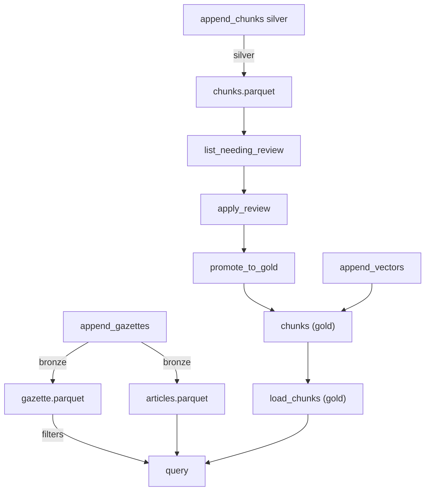

# Storage medallion

Este documento descreve o módulo de persistência local seguindo as camadas Bronze/Silver/Gold.

## Layout de diretórios

```text
  data/
    bronze/city_id=123/yyyymm=202603/
      gazette.parquet
      articles.parquet
      manifest.json
    silver/city_id=123/yyyymm=202603/parser_tag=v1/
      chunks.parquet
      manifest.json
    gold/city_id=123/yyyymm=202603/embedding_model_tag=e5-base/
      chunks.parquet
      vectors.parquet
      manifest.json
    logs/ingestion.log
```

## Fluxo principal



## Uso rápido

```python
import polars as pl
from diario_contract.article.article import Article
from diario_contract.article.content import ArticleContent
from diario_contract.article.metadata import ArticleMetadata
from diario_contract.enums.content_type import ContentType
from diario_contract.gazette.edition import GazetteEdition
from diario_contract.gazette.metadata import GazetteMetadata
from diario_utils.storage import StorageClient, StorageConfig

client = StorageClient(StorageConfig(base_path="data", duckdb_path=":memory:"))

edition = GazetteEdition(
    metadata=GazetteMetadata(
        edition_id="ed1",
        publication_date="2026-03-01",
        edition_number=1,
        supplement=False,
        edition_type_id=1,
        edition_type_name="regular",
        pdf_url="http://example.com",
    ),
    articles=[
        Article(
            metadata=ArticleMetadata(
                article_id="a1",
                edition_id="ed1",
                hierarchy_path=["root"],
                title="title",
                identifier="id-1",
                protocol=None,
            ),
            content=ArticleContent(
                raw_content="content", content_type=ContentType.TEXT
            ),
        )
    ],
)

client.append_gazettes([edition], city_id="123")

chunks = pl.DataFrame([
    {
        "chunk_id": "c1",
        "city_id": "123",
        "publication_date": "2026-03-01",
        "publication_month": "202603",
        "text": "lorem",
        "needs_review": True,
        "parser_tag": "v1",
    }
])
client.append_chunks(chunks, {"city_id": "123", "publication_date": "2026-03-01", "parser_tag": "v1"})

needing = client.list_needing_review()
client.apply_review(chunk_id="c1", reviewer_id="alice", status="approved")
client.promote_to_gold(["c1"], embedding_model_tag="e5-base", retrieval_profile="default")
```

## Logging estruturado

- O módulo `diario_utils.logging.structlog_config` fornece `configure_structlog` (idempotente) e `get_logger`.
- Saída padrão: JSON lines em stdout; opcionalmente também em `${base_path}/logs/ingestion.log` com `configure_structlog(log_file=...)`.
- Eventos emitidos pelo `StorageClient` incluem `write_table`, `append_gazettes`, `append_chunks`, `append_vectors`, `list_needing_review`, `apply_review`, `promote_to_gold` e `storage_run` (registro de execuções).
- Campos registrados evitam conteúdos sensíveis (texto/bytes de chunks) e focam em metadados como `layer`, `table`, `city_id`, `publication_month`, contagens de linhas e hashes de manifest.
